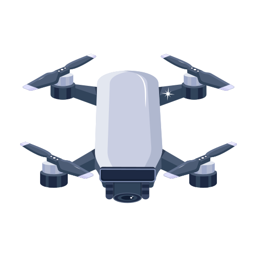

<h1 align="center"> drone-aruco-localization </h1>

<p align="center">
  
</p>

<p align="center"> Estimation of a current drone position based on ArUco markers </p>

## Project description
The position estimation process is based on establishing correspondences between points in the real environment (represented by ArUco markers with known 3D coordinates and their 2D projections in the image plane.
For each frame froma video sequence recorded by a drone camera: (i) detect and identify the ArUco markers,(ii) estimate the drone position (i.e. the drone-mounted camera position) using the camera matrix.

## Project structure
- config/ → parameters (e.g. camera calibration)
- data/ → input and output data
  - proccesed/ → proccesed files
  - raw/ → raw CSV and MP4 files
- docs/ → all documentation (PDFs, reports, diagrams)
- src/ → source code (e.g. OpenCV, ArUco, position estimation)
- Dockerfile → in the root directory (standard)

## Prepare input data
Copy your recorded MP4 files into the following directory:

```bash
data/raw/
```
Example
```bash
cp /path/to/your/videos/*.MP4 data/raw/
```

## Position estimation

Install dependencies (from the project root):

```bash
pip install -r requirements.txt
```

Run localization on a video and write a per-frame trajectory CSV (ArUco estimate vs mocap reference when `--mocap` is provided):

```bash
python src/estimate_position.py \
  --video data/raw/GX010280.MP4 \
  --markers data/raw/ArUco_markers_3D.xlsx \
  --mocap data/raw/GX010280_U.csv
```

Output (default): `data/processed/<video_stem>_trajectory.csv` with columns `est_x_mm`, `est_y_mm`, `est_z_mm`, `ref_x_mm`, `ref_y_mm`, `ref_z_mm`, and `error_mm`.

## Compare positions (charts)

Generate comparison plots from a trajectory CSV produced by `estimate_position.py`:

```bash
python src/plot_trajectory.py --input data/processed/GX010280_trajectory.csv
```

This writes two PNG files under `data/processed/`:

| File | Description |
|------|-------------|
| `<stem>_comparison.png` | X, Y, Z vs frame (ArUco vs mocap) and 3D position error |
| `<stem>_comparison_3d.png` | Overlaid 3D trajectories |

Useful options:

```bash
# Custom output path
python src/plot_trajectory.py --input data/processed/GX010280_trajectory.csv \
  --output data/processed/my_comparison.png

# Interactive window (no files saved unless --output is set)
python src/plot_trajectory.py --input data/processed/GX010280_trajectory.csv --show

# Stricter outlier filter (default: hide frames with error > 500 mm)
python src/plot_trajectory.py --input data/processed/GX010280_trajectory.csv --max-error-mm 300
```

Failed pose estimates (very large coordinates or errors) are omitted from the ArUco curves so the scale stays readable; mocap reference is still shown for all frames.

## Build and Run Docker container

To build the Docker image based on the provided Dockerfile, run:
```bash
docker build -t drone-aruco-localization .
```
### Run container (macOS with XQuartz)

Before starting the container, allow connections to the X server (run this in your host terminal, not inside Docker):
```bash
xhost +
```
Then start the container:
```bash
docker run -it --rm \
  -e DISPLAY=docker.for.mac.host.internal:0 \
  -v "$HOME/Projects/drone-aruco-localization/data/raw:/data/raw" \
  drone-aruco-localization
```